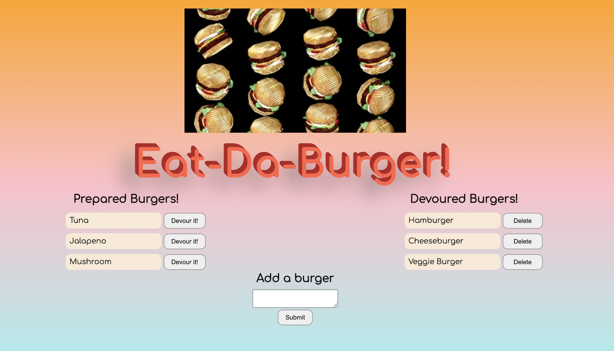

### Burger Logger 🍔 🦸


## Description  🍔 📈  
Eat-Da-Burger is a burger logger that allows me to add a burger to a list accompanied by a button that allows me to move that burger on to another list where the burger can then be deleted. 

The MVC design pattern is followed. MySQL, Node JS, Express, Handlebars and a homemade ORM are utilized to make this an intractive and user-friendly application. 

## Deployed App  🚀 👽  
Eat-Da-Burger is on **Heroku**! [Click here to launch](https://log-my-burgers.herokuapp.com/).

## Installation Steps 🦾 ✨ 
* Fork the repo.
```bash
$ node server.js
$ npm install
$ npm i mysql --save
$ npm i express
$ npm i express-handlebars
```

## Usage 👩🏽‍🏫 🪄 
To start this application input this command in the terminal
```bash
node server.js
```
